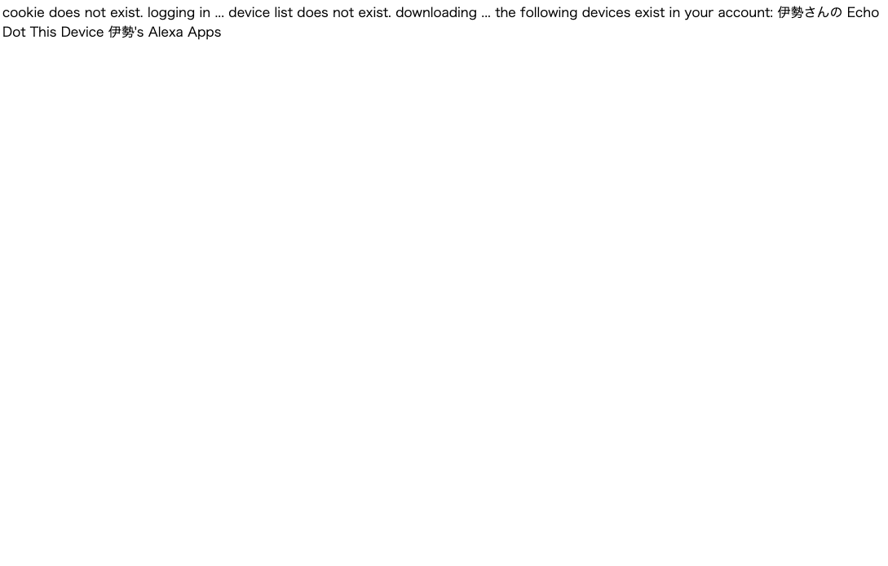
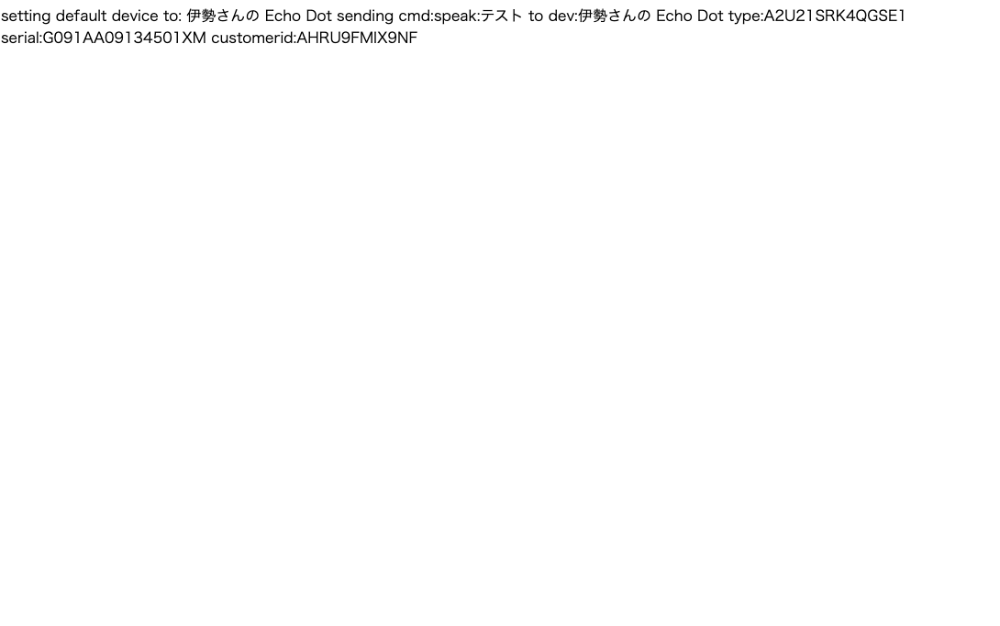

# 🌙 alexa-remote-control


## 📗 プロジェクトの概要

「alexa-remote-control」を利用してAlexaを自由に喋らせる仕組みを構築します。
PHP経由でAlexaとの通信を行います。

### 利用している技術

- apache
- php
- alexa-remote-control

## 📦 ディレクトリ構造
```
.
├── LICENSE
├── README.md
├── dc.sh
├── docker
│   ├── docker-compose.yml
│   └── ubuntu
└── htdocs
    ├── alexa_remote_control.sh
    ├── env.example.sh
    ├── env.sh
    ├── exec.php
    └── index.php

```

## 🔧 環境の構築

※ この環境を利用する為には、事前にdocker、docker-composeが動作する状態であることが前提条件です。
(Windowsの場合は、以下を参考に「WSL」と「Docker Desktop for Windows」を用意してください)

### WSLのインストール（Windowsの場合）
参考
https://docs.microsoft.com/ja-jp/windows/wsl/install

WSLでUbuntuを起動する
```
# 初回起動時に、ユーザ名とパスワードが聞かれます。
# 何も入力せずにEnterを押すとroot ユーザーで利用できるようになるので、rootユーザーとして設定します。

# 初めにライブラリを最新化します。
$ apt update

# 日本語に対応しておきます。
$ apt -y install language-pack-ja
$ update-locale LANG=ja_JP.UTF8
$ apt -y install manpages-ja manpages-ja-dev
```

### Docker Desktop for Windows のインストール（Windowsの場合）

https://docs.docker.com/docker-for-windows/install/
```
↓コマンドプロンプトでバージョンが表示されればOK
docker --version
```

### WSL2から、Docker for Windows を利用できるようにする（Windowsの場合）
参考
https://qiita.com/endo_hizumi/items/0cc50bdfbd827579733e
```
１．通知領域から、dockerのアイコンを右クリックして、Settingを選択
２．Generalのexpose deamon on~~のチェックを入れます。
３．ResourcesのWSL INTEGRATION から、"Ubuntu" をスイッチをONにします。

WSL 側のルートを Docker for Windows に合わせるように WSL のマウント設定を行います。
$ vi /etc/wsl.conf
---
[automount]
root = /
options = "metadata"
---

以下のように Cドライブのパスが"/mnt/c/"→"/c/" に変更されていれば正常です。
$ cd /c/Users/USER/github/laravel-react-boilerplate
$ pwd
/c/Users/USER/github/laravel-react-boilerplate

# WSL 上にDockerとDocker Composeをインストールする。
$ apt install docker
$ apt install docker-compose

これでWSLからWindows側にインストールしたDockerが利用できるようになります。
```

## 🖊️ 使い方

```bash
# Dockerを起動します。
$ ./dc.sh start
```

Deviceを確認する
http://localhost/exec.php?status


メッセージを送信する
http://localhost/exec.php?text_tts=テスト


## 🔗 参考

| プロジェクト| 概要|
| :---------------------------------------| :-------------------------------|
| [Alexa(Amazon Echo)をコマンドラインから自由に喋らせる方法](https://qiita.com/shge/items/169de61c8f246d26c110)| Alexa(Amazon Echo)をコマンドラインから自由に喋らせる方法|


## 🎫 Licence

[MIT](https://github.com/isystk/alexa-remote-control/blob/master/LICENSE)

## 👀 Author

[isystk](https://github.com/isystk)
